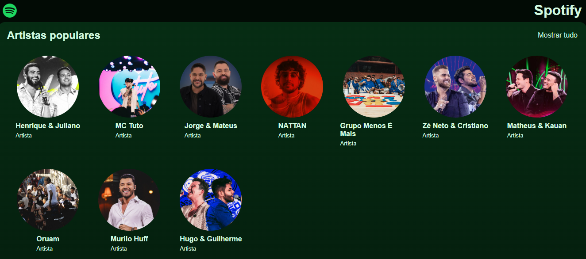
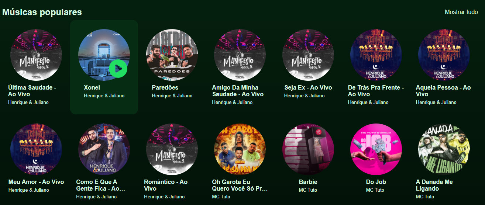
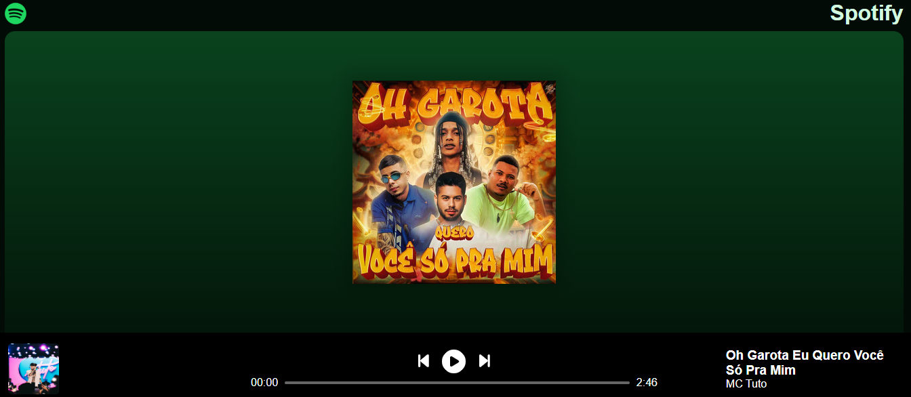

# Clone do Spotify com React

## Sobre o Projeto
Este projeto é um clone da interface do Spotify, desenvolvido durante o Intensivão de React promovido pela **Hashtag Treinamentos**. Trata-se de uma aplicação front-end que replica a experiência visual e funcional da popular plataforma de streaming de música, construída utilizando tecnologias modernas de desenvolvimento web.

## Tecnologias Utilizadas

- **HTML5** - Estruturação da página
- **CSS3** - Estilização e responsividade
- **JavaScript** - Lógica de programação e interatividade
- **React.js** - Biblioteca para construção da interface
- **React Router** - Navegação entre páginas da aplicação
- **Hooks** - useState, useParams, useLocation

## Funcionalidades Implementadas

- 🎵 Exibição de artistas populares na página inicial


- 🎧 Listagem de músicas populares


- 👨‍🎤 Páginas de perfil para cada artista


- 🎼 Layout de reprodução de músicas com controles de player 


- 🧭 Sistema de navegação entre diferentes seções
- 🎹 Página detalhada por música

## Estrutura do Projeto
O projeto segue as melhores práticas de organização de código React:

```
/src
  /components        # Componentes reutilizáveis
  /pages             # Páginas principais da aplicação
  /database          # Dados simulados de artistas e músicas
  /hooks             # Hooks personalizados
  /assets            # Imagens e recursos estáticos
  /routes            # Configuração de rotas
  /styles            # Estilos globais e variáveis CSS
```

## Capturas de Tela

### Página Inicial com Artistas Populares
A página inicial apresenta uma grid de artistas populares com suas imagens em formato circular, similar à interface oficial do Spotify. A navegação superior permite acessar diferentes seções do aplicativo.

### Listagem de Músicas Populares
Exibe as músicas em destaque, mostrando capa do álbum, título da música e nome do artista. Cada item é clicável e direciona para a página de reprodução da música.

### Página do Artista
Ao selecionar um artista, o usuário é direcionado para uma página personalizada com banner, foto de perfil e lista das músicas mais populares daquele artista específico.

### Player de Música
Interface de reprodução com controles de play/pause, anterior/próximo, barra de progresso e informações da música atual. O layout mantém a estética característica do Spotify com fundo escuro e elementos de destaque em verde.

## Conceitos Aprendidos
Durante o desenvolvimento deste projeto no Intensivão da **Hashtag Treinamentos**, foram abordados diversos conceitos fundamentais:

- Estruturação de projetos React
- Componentes funcionais e props
- Gerenciamento de estado com Hooks
- Navegação com React Router
- Convenções de nomenclatura
- CSS modular e metodologia BEM
- Consumo de dados estáticos
- Renderização condicional
- Manipulação de eventos

## Instalação e Execução

```bash
# Clone o repositório
git clone https://github.com/DevWesleyMedeiros/projeto-clone-do-spotify

# Entre no diretório
cd spotify-clone

# Instale as dependências
npm install

# Execute a aplicação
npm start
```
## Recursos e Dados
O projeto utiliza dados simulados localizados na pasta `database`, que contém:

- `artists.js` - Informações sobre artistas (id, nome, imagem, banner)
- `songs.js` - Informações sobre músicas (id, nome, duração, artista, capa, arquivo de áudio)

## Licença
Este projeto está sob a licença MIT.

## Agradecimentos
Agradecimento especial à **Hashtag Treinamentos** pela excelente iniciativa do Intensivão de React, que proporcionou o aprendizado prático e eficiente das tecnologias utilizadas neste projeto.

---

⚠️ **Nota:** Este é um projeto educacional desenvolvido apenas para fins de aprendizado e não tem qualquer associação oficial com o Spotify.